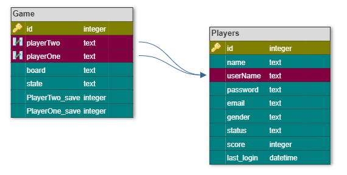

# TicTacToe GameServer 
Welcome to the TicTacToe GameServer, a simple Java application allowing users to interact with our GameServer. 
# Getting up and running
  Download the code, open it from your IDE. If you are using NetBeans IDE 8.2 you can follow the link below. 
  (https://drive.google.com/drive/folders/1VGaFfkht6mgTYx83aW9iO4QkBtRY048d). Run the appliction, now you can start the server. 
  the server is waiting the Gameclient to run. 
  Download Game Client from this link (https://github.com/ahmedKhaled1995/tic_tak_toe_client_ui_final)
# Built With
  •	JSON-Simple  
  •	Sqlite  
  •	Java 
  •	Maven 
# Database Schema
 
# Authors
ITI Team : 
Ahmed khaled 
Ahmed Zakria 
Shehab El-Deen Alalkamy 
Sondos Medhat 
Hager Mohamed 
